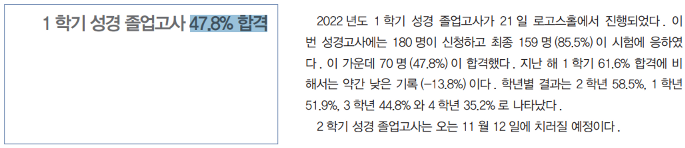

<div align="center">

# KBU BibleGraduationExam QuizApp API Server

<a href="https://nodejs.org/ko/download/">

</a>
<a href="https://expressjs.com/ko/">
 
</a>
<a href="https://www.mysql.com/">

</a>
<a href="https://avatars.dicebear.com/">

</a>
<a href="https://www.deta.sh/">

</a>

</div>

- [KBU BibleGraduationExam QuizApp API Server](#kbu-biblegraduationexam-quizapp-api-server)
  - [소개](#소개)
  - [`src` 폴더 구조](#src-폴더-구조)
  - [ERD](#erd)
  - [순서도](#순서도)
  - [Setup (dev)](#setup-dev)
  - [참고문헌](#참고문헌)


## 소개

한국성서대학교 재학생들의 성경 졸업 고사를 사전에 대비하고자 만든 퀴즈 형태의 모바일 애플리케이션입니다. 2주 안팎에 준비해야한다는 조급함과 낮은 합격률은 학습에 거부감을 생기게하는데 이를 해결합니다.



## `src` 폴더 구조

```bash
+---History
|       controller.js
|       dao.js
|       provider.js
|       route.js
|       service.js
|
+---LeaderBoard
|       controller.js
|       dao.js
|       provider.js
|       route.js
|
+---middleware
|       authentication.js
|       cors.js
|       morgan.js
|       session.js
|
+---modules
|       response.js
|
+---Quiz
|       controller.js
|       dao.js
|       provider.js
|       route.js
|       service.js
|
\---User
        controller.js
        dao.js
        provider.js
        route.js
        service.js
```

## [ERD](https://www.erdcloud.com/p/vzY38iExRFRMcLYNv)

링크를 확인해주세요.

## 순서도

<details open>
<summary>퀴즈 순서도</summary>


</details>

<details>
<summary>오답노트 순서도</summary>



</details>

## Setup (dev)

Download [Node.js](https://nodejs.org/ko/download/).

```bash
# Install dependencies (only the first time)
npm install
# Run the local server at localhost:5000
npm run dev
```

<hr/>

## 참고문헌

[kokos 성경 졸업 고사 합격률, 2022년 6월호, 7면](https://stor.bible.ac.kr/kokkos/2022/2022-06_KOKKOS.pdf)
